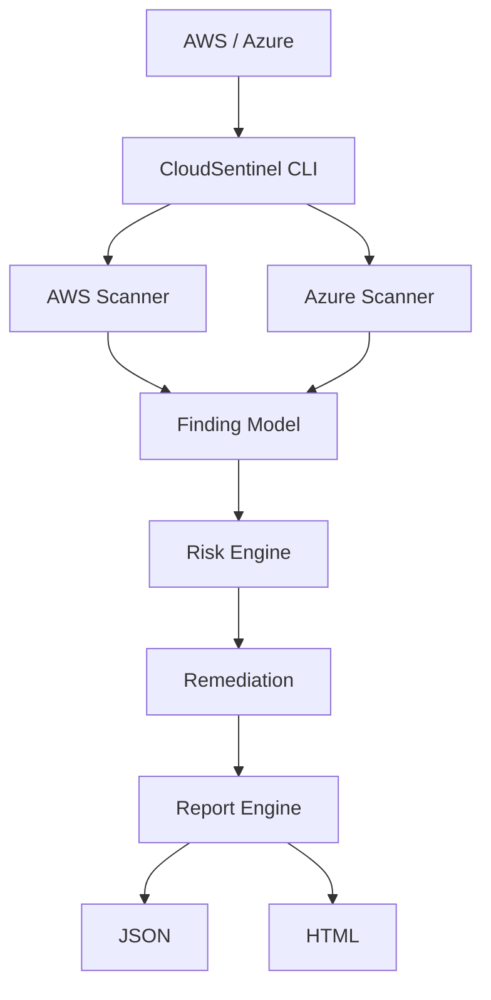

# CloudSentinel

**Multi-cloud security posture management and misconfiguration detection platform for AWS and Azure.**


CloudSentinel replaces manual cloud console checks with a fast, deterministic **Risk Engine** that outputs actionable findings mapped to severity levels.

## 🚀 Features
- **✓ AWS security scanning**: Analyzes AWS resources using `boto3`.
- **✓ Azure security scanning**: Analyzes Azure resources using `azure-identity`.
- **✓ IAM/RBAC analysis**: Detects over-privileged roles, Root MFA, and direct admin access.
- **✓ Storage exposure detection**: Identifies public S3 buckets and Azure Blob containers.
- **✓ Network security analysis**: Highlights exposed `0.0.0.0/0` SSH/RDP ingress rules.
- **✓ Cloud logging checks**: Ensures CloudTrail and Azure Monitor are correctly deployed.
- **✓ Deterministic risk scoring**: Normalized 0-100 risk score engine.
- **✓ Remediation guidance**: Step-by-step instructions on mitigating detected flaws.
- **✓ JSON reports**: Machine-readable output for SIEM/CI integration.
- **✓ HTML reports**: Beautiful, interactive security dashboards.
- **✓ Terraform vulnerable labs**: Intentionally vulnerable IaaC for local testing.
- **✓ Automated CI security checks**: Secret scanning, dependencies, linting, and tests.

## 🏗️ Architecture



## 🎥 Demo

### Vulnerable Lab

The repository includes a `lab/terraform/` directory that provisions intentionally insecure test resources (S3, Security Groups, IAM, Azure Blob, NSG, RBAC). **⚠️ ONLY use this in isolated test accounts.**

### Scan

CloudSentinel detects:
- IAM misconfiguration
- Public storage
- Network exposure
- Logging issues
- RBAC problems

### Output

JSON + HTML security reports are generated with actionable remediation steps.

*(Demo screenshots can be viewed in the `reports/` output when generated.)*

## ⚙️ Installation & Usage

### 1. Setup
```bash
git clone https://github.com/raghavkhandal72-coder/CloudSentinel.git
cd CloudSentinel

# Setup virtual environment
python -m venv .venv
source .venv/bin/activate  # Windows: .venv\Scripts\activate

# Install dependencies
pip install -r backend/requirements.txt
```

### 2. Run the Scanner (Mock Demo)

Recruiters and evaluators can immediately run the scanner in mock mode to simulate a multi-cloud environment locally, without needing actual AWS/Azure credentials!

```bash
python -m backend.main --mock --report html
```

### 3. Run on Live Environment

Ensure you have authenticated to your cloud providers locally (`aws configure` or `az login`).

```bash
python -m backend.main --aws --azure --report md
```

*Note: Required Environment Variables (if using Docker/Compose instead of local profiles): `AWS_ACCESS_KEY_ID`, `AWS_SECRET_ACCESS_KEY`, `AZURE_CLIENT_ID`, `AZURE_TENANT_ID`, `AZURE_CLIENT_SECRET`.*

## 🧪 Testing and CI/CD
CloudSentinel is highly tested and secured via GitHub Actions.

Run the test suite locally:
```bash
pytest -q
```

Quality and security checks:
```bash
ruff check .
bandit -r backend/
pip-audit -r backend/requirements.txt
```

## ⚠️ Security Notice
This tool runs read-only queries against your cloud environments. Please review `SECURITY.md` for our vulnerability disclosure policy and credential handling guidelines.
